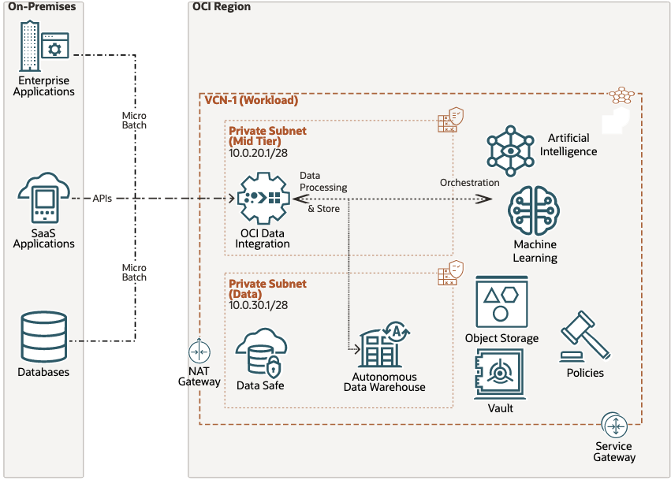

# Terraform OCI Data Integration Services Architecture

## Reference Architecture

This Terraform code creates a workspace in a defined VCN subnet, and applied all the necessary policies for the execution against the data assets for OCI Object Store and Oracle ADW. The Terraform application also uploads all the DIS Templates tasks, making the workspace readily available.
## Architecture Diagram 



## Prerequisites

- Permission to `manage` the following types of resources in your Oracle Cloud Infrastructure tenancy: `dis-family`,`buckets`; permission to `read metrics` in the compartment where the DIS workspace will be created. 
- Quota to create at least 1 DIS Workspace in the tenancy.

If you don't have the required permissions and quota, contact your tenancy administrator. See [Policy Reference](https://docs.cloud.oracle.com/en-us/iaas/Content/Identity/Reference/policyreference.htm), [Service Limits](https://docs.cloud.oracle.com/en-us/iaas/Content/General/Concepts/servicelimits.htm), [Compartment Quotas](https://docs.cloud.oracle.com/iaas/Content/General/Concepts/resourcequotas.htm).

## Installation 
### Deploy Using the Terraform CLI

### Clone the Module

Now, you'll want a local copy of this repo. You can make that with the commands:

```
    git clone git@github.com:oracle-samples/oracle-dis-samples.git
    cd oracle-dis-samples
    ls
```

### Prerequisites
First off, you'll need to do some pre-deploy setup.  That's all detailed [here](https://github.com/cloud-partners/oci-prerequisites).

Create a `terraform.tfvars` file, and specify at least the following variables:

```
# Authentication
tenancy_ocid        = "<tenancy_ocid>"
user_ocid           = "<user_ocid>"
fingerprint         = "<finger_print>"
private_key_path    = "<pem_private_key_path>"

region              = "<oci_region>"
compartment_ocid    = "<compartment_ocid>"

# IAM Group with permissions to run create the DIS instances
DISadmingroup = "<DIS Administrator Group>"

# DIS
workspace_display_name = "<DIS Workspace Display Name>" # Ex: DIS Reference Architecture v0.1"
workspace_is_private_network_enabled = "true"
workspace_subnet_id = "<ocid.subnet....>"
workspace_vcn_id = "<ocid1.vcn....>"
workspace_project_identifier = "<Project Identifier to save Template Design Artifacts>" # Ex: TEMPLATES_DEVELOPMENT"
workspace_project_name = "<Project Name>" 
workspace_project_description = "<Project Descrptiom>" 
workspace_project_folder_identifier = "<Folder Identifier>" # Ex: REFERENCE_PROJECT_FOLDER
workspace_project_folder_name = "<Folder Name>" # 
workspace_project_folder_description = "<Folder Description>" 

```
## How to run it?

### Create the Resources

Run the following commands:

    terraform init
    terraform plan
    terraform apply

### Removing the environment
When you no longer need the deployment, you can run this command to destroy the resources:

    terraform destroy

### Testing your Deployment
After the deployment, you can access the Data Integration Workspace for the OCI Console.

## Documentation (OCI Data Integration Services) 
For how-to-use OCI-DI and features:
https://docs.oracle.com/en-us/iaas/data-integration/home.htm

### OCI-DI APIs
https://docs.oracle.com/en-us/iaas/api/#/en/data-integration/20200430/

### OCI-DI Templates
https://blogs.oracle.com/dataintegration/post/oci-data-integration-service-templates

## Attribution & Credits

## Contributing

This project welcomes contributions from the community. Before submitting a pull request, please [review our contribution guide](./CONTRIBUTING.md)

## Security

Please consult the [security guide](./SECURITY.md) for our responsible security vulnerability disclosure process

## License

Copyright (c) 2023 Oracle and/or its affiliates.

Released under the Universal Permissive License v1.0 as shown at
<https://oss.oracle.com/licenses/upl/>.
